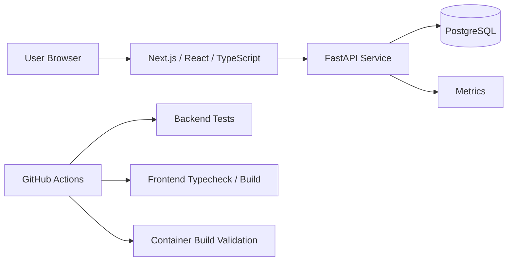

# CloudGenius Ontario Population Intelligence Platform (OPIP)

**Client overview:** [Client-facing case study](./CASE-STUDY.md)

## Outcome & Evidence

| Evidence | Result |
|---|---|
| Frontend | Next.js / React / TypeScript |
| API | Python FastAPI |
| Data tier | PostgreSQL |
| Local integration | Docker Compose |
| Operational endpoints | Health, readiness, and metrics endpoints |
| Backend validation | Pytest in CI |
| Frontend validation | TypeScript typecheck + production build in CI |
| Container validation | API and frontend image builds in CI |
| Delivery evidence | Initial vertical slice passed all three CI gates before merge |

**Proof:** CI workflow, application source, tests, container definitions, and the [client-facing case study](./CASE-STUDY.md) are all included in the repository.

## Architecture at a glance



---

> A production-style population intelligence application and DevSecOps engineering project demonstrating how a modern web workload can progress from source code to a secure, observable, GitOps-managed Kubernetes platform.

[](https://github.com/globalcloudgenius/cloudgenius-opip-app/actions/workflows/ci.yml)


## Overview

CloudGenius OPIP is a portfolio and training platform built around an Ontario population analytics use case. The project is intentionally being delivered in progressive, production-oriented stages: first establish a functional application baseline, then introduce security controls, artifact management, Kubernetes, GitOps, secrets management, observability, progressive delivery, ChatOps, and disaster recovery.

The current release provides a complete first vertical slice:

```text
User Browser
     |
     v
Next.js / React / TypeScript Dashboard
     |
     v
Python FastAPI Population Service
     |
     v
PostgreSQL
```

The repository is not affiliated with the Government of Ontario or Statistics Canada.

> **Data notice:** The population values currently shipped with the repository are synthetic demonstration data created for software engineering and training. They are not official statistics and must not be represented as authoritative population figures.

## What is implemented

### Professional web dashboard

The frontend is a responsive Next.js/React application written in TypeScript. It presents population KPIs, municipality-level analytics, a graphical population comparison, dataset context, API/platform status, and resilient loading/error states. Recharts is used for interactive data visualization and Lucide provides the UI iconography.

### Population API

The backend is a Python FastAPI service using SQLAlchemy for persistence. It exposes population records and summary analytics and includes operational endpoints suitable for container health checks and monitoring.

Current endpoints include:

```text
GET /health
GET /ready
GET /api/v1/population
GET /api/v1/population?year=2025
GET /api/v1/population?municipality=Toronto
GET /api/v1/summary
GET /metrics
```

FastAPI also provides interactive OpenAPI documentation at `/docs`.

### PostgreSQL data layer

PostgreSQL provides the persistent data tier. The local environment automatically initializes the schema and loads the synthetic Ontario training dataset. A named Docker volume preserves local database state between container restarts.

### Containerized local environment

The complete vertical slice can be started with Docker Compose. PostgreSQL, the API, and the frontend run as separate services on an isolated application network. Database and API health checks control startup ordering, and application containers use restart policies appropriate for a local integration environment.

### CI quality gates

GitHub Actions validates every pull request targeting `main` and every push to `main`. The current pipeline contains three gates:

```text
Pull Request / Push
        |
        +--> Backend tests
        |      Python 3.13
        |      Dependency installation
        |      Pytest
        |
        +--> Frontend validation
        |      Node.js 22
        |      TypeScript typecheck
        |      Next.js production build
        |
        +--> Container build validation
               FastAPI image build
               Next.js image build
```

Container validation runs only after the backend and frontend jobs succeed. Workflow concurrency cancels superseded runs for the same ref, reducing unnecessary CI execution.

The initial application baseline passed all three CI gates before being squash-merged into `main`.

## Technology stack

| Layer | Technology |
| --- | --- |
| Frontend | Next.js, React, TypeScript |
| Visualization | Recharts |
| UI icons | Lucide React |
| Backend API | Python, FastAPI |
| ORM | SQLAlchemy |
| Database | PostgreSQL |
| PostgreSQL driver | Psycopg |
| API metrics | Prometheus FastAPI Instrumentator |
| Backend testing | Pytest, HTTPX |
| Containers | Docker |
| Local orchestration | Docker Compose |
| CI | GitHub Actions |
| Source control | Git / GitHub |

## Repository structure

```text
cloudgenius-opip-app/
├── .github/
│   ├── workflows/
│   │   └── ci.yml
│   ├── CODEOWNERS
│   └── PULL_REQUEST_TEMPLATE.md
├── database/
│   └── init.sql
├── frontend/
│   ├── app/
│   ├── Dockerfile
│   ├── package.json
│   └── tsconfig.json
├── services/
│   └── population-api/
│       ├── app/
│       │   ├── database.py
│       │   ├── main.py
│       │   ├── models.py
│       │   └── schemas.py
│       ├── tests/
│       ├── Dockerfile
│       └── requirements.txt
├── .env.example
├── CONTRIBUTING.md
├── docker-compose.yml
├── LICENSE
└── README.md
```

## Quick start

### Prerequisites

Install Git and Docker with Docker Compose support.

Clone the repository and create your local environment file:

```bash
git clone https://github.com/globalcloudgenius/cloudgenius-opip-app.git
cd cloudgenius-opip-app
cp .env.example .env
```

On Windows PowerShell, the equivalent copy command is:

```powershell
Copy-Item .env.example .env
```

Start the complete stack:

```bash
docker compose up --build
```

Once the services are healthy, use:

| Component | Local address |
| --- | --- |
| OPIP Dashboard | `http://localhost:3000` |
| Population API | `http://localhost:8000` |
| Swagger / OpenAPI | `http://localhost:8000/docs` |
| API health | `http://localhost:8000/health` |
| API readiness | `http://localhost:8000/ready` |
| Prometheus metrics | `http://localhost:8000/metrics` |

Stop the environment:

```bash
docker compose down
```

To delete the local PostgreSQL volume and reseed the demonstration dataset on the next startup:

```bash
docker compose down -v
docker compose up --build
```

## Running validation locally

Backend tests:

```bash
cd services/population-api
python -m pip install -r requirements.txt
python -m pytest -q
```

Frontend type checking and production build:

```bash
cd frontend
npm install
npm run typecheck
npm run build
```

Container build validation:

```bash
docker build -t opip-api:local services/population-api
docker build --build-arg NEXT_PUBLIC_API_URL=http://localhost:8000 -t opip-frontend:local frontend
```

## Configuration and secrets

`.env.example` documents the local configuration contract. Copy it to `.env` for local development; `.env` is intentionally excluded from source control.

Never commit passwords, API tokens, private keys, certificates, cloud credentials, production database connection strings, Vault tokens, Harbor credentials, or other secrets. The current values are local-development placeholders only. Runtime secrets will move to HashiCorp Vault as the platform phase is implemented.

## Git and pull-request workflow

`main` is treated as the integration branch and is protected against deletion and force pushing. Routine development should occur on short-lived branches using names such as `feature/...`, `fix/...`, `docs/...`, or `chore/...`.

The expected engineering flow is:

```text
Create branch
    |
Develop and test
    |
Commit + push
    |
Open pull request
    |
GitHub Actions quality gates
    |
Peer review / resolve feedback
    |
Squash merge to main
```

`CONTRIBUTING.md`, `CODEOWNERS`, and the pull-request template establish the repository's initial collaboration controls.

## Operational design

The API exposes separate liveness-style (`/health`) and readiness (`/ready`) endpoints so later Kubernetes probes can distinguish process availability from dependency readiness. `/metrics` exposes Prometheus-compatible application telemetry for the observability phase.

Both application components have production-oriented Dockerfiles. The frontend uses a multi-stage Next.js build and runs as a non-root user. The API image also runs as a non-root application user. Docker Compose is used only for local/integration execution; Kubernetes will become the target runtime in the platform phase.

## DevSecOps target architecture

The planned delivery path is:

```text
Developer
   |
Feature Branch
   |
Pull Request
   |
CI: Tests + Build + Security Gates
   |
Container Build
   |
Trivy Image Scan
   |
Harbor Registry
   |
GitOps Repository
   |
Argo CD
   |
Argo Rollouts
   |
Kubernetes
   |
+-- Vault
+-- PostgreSQL
+-- Prometheus / Grafana / Loki
+-- Alertmanager -> Slack
+-- Wazuh / Splunk / Zeek
```

Application source and deployment state are intentionally separated: this repository owns application source and build logic, while `cloudgenius-gitops` is intended to own the Kubernetes/GitOps desired state as the deployment phase begins.

## Delivery roadmap

**Phase 1 — Application baseline (completed)**  
Next.js dashboard, FastAPI API, PostgreSQL, synthetic dataset, Docker/Docker Compose, automated tests, CI build validation, repository governance, and protected-branch development workflow.

**Phase 2 — DevSecOps security gates**  
SAST, dependency and secret scanning, Trivy filesystem/image scanning, security reporting, and required CI checks.

**Phase 3 — Artifact management**  
Versioned container images, Harbor at `harbor.cloudgenius.ca`, immutable image promotion conventions, and vulnerability policy.

**Phase 4 — Kubernetes platform**  
Namespaces, Helm packaging, resource requests/limits, probes, Pod security controls, Calico network policies, configuration management, and ingress.

**Phase 5 — GitOps and progressive delivery**  
Argo CD reconciliation, separation of application and environment state, Argo Rollouts, canary releases, health analysis, and automated rollback.

**Phase 6 — Secrets and identity**  
HashiCorp Vault integration, Kubernetes authentication, least-privilege policies, dynamic/managed application secrets, and secret rotation patterns.

**Phase 7 — Observability and ChatOps**  
Prometheus, Grafana, Loki, Alertmanager, application dashboards, SLO-oriented alerting, and Slack deployment/incident notifications.

**Phase 8 — Resilience and security operations**  
Velero and PostgreSQL-aware backup/restore, failure injection, recovery exercises, security telemetry integration with Wazuh/Splunk/Zeek, and documented incident/DR runbooks.

## Engineering principles

The project follows a few core rules: build a working vertical slice before adding platform complexity; never develop directly on `main`; make automated validation part of the merge path; keep secrets out of Git; run application containers without root privileges where practical; expose health, readiness, and metrics from the beginning; separate application source from GitOps desired state; and make rollback, monitoring, security, and recovery first-class parts of delivery rather than afterthoughts.

## Project status

**Current milestone:** Phase 1 application baseline is complete and merged. The application can be built as independent frontend/API containers, the complete local stack can be orchestrated with Docker Compose, and the merge path is protected by backend tests, frontend validation, and container build checks.

**Next milestone:** Add DevSecOps security gates and establish the Harbor image publishing/promotion workflow before Kubernetes deployment.

## Disclaimer

CloudGenius OPIP is an independent training and portfolio project. It is not an official Government of Ontario service and is not endorsed by or affiliated with the Government of Ontario or Statistics Canada. The included dataset is synthetic and exists solely to exercise the application and platform engineering workflow.

## License

This project is licensed under the MIT License. See `LICENSE` for details.

---

## Consulting relevance

OPIP demonstrates how I approach modern application and platform delivery across architecture, software engineering, containers, CI, security controls, observability, and operational readiness.

Typical consulting use cases include:

- application modernization;
- cloud-native architecture;
- DevOps / DevSecOps enablement;
- containerization;
- CI/CD design;
- platform engineering;
- technical leadership across application and infrastructure teams.

**Consulting inquiries:** advisory@cloudgenius.ca · https://cloudgenius.ca

